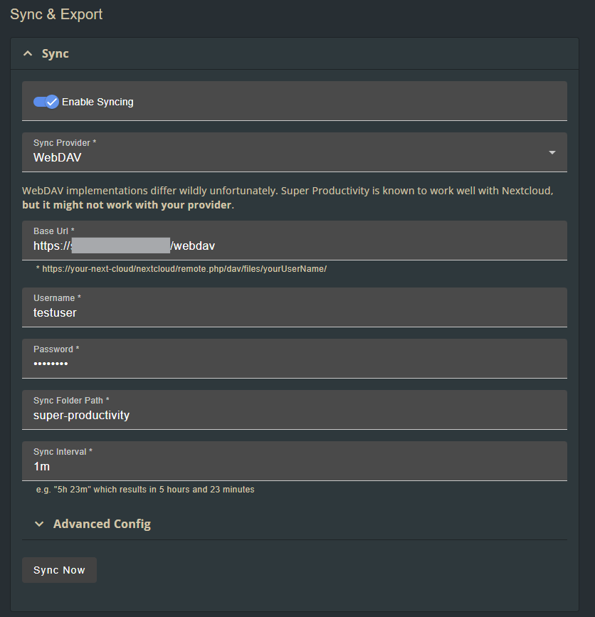

# R2-WebDAV Multi-User Edition

A production-ready, multi-user WebDAV server built on Cloudflare Workers and R2 storage, optimized for sync services like Super-Productivity.

> **Fork Enhancement**: This is an enhanced fork of [abersheeran/r2-webdav](https://github.com/abersheeran/r2-webdav) with multi-user support, sync client compatibility, and enterprise features.

## 🚀 Key Improvements Over Original

| Feature | Original | This Fork |
|---------|----------|-----------|
| **User Support** | Single user | Unlimited users with isolated storage |
| **Storage Model** | One shared bucket | Dedicated R2 bucket per user |
| **Sync Compatibility** | Basic WebDAV | Full Super-Productivity support with revision tracking |
| **CORS Support** | Limited | Complete CORS on all responses |
| **Security** | Basic auth | Timing-safe auth comparison |
| **User Management** | Manual config | Automated PowerShell scripts |
| **Custom Domains** | Manual setup | Built-in routing configuration |
| **Conflict Detection** | None | If-Unmodified-Since support |

## ✨ Features

### Core WebDAV Protocol
- ✅ **Complete WebDAV implementation** - All standard methods supported
- ✅ **Methods** - GET, PUT, DELETE, MKCOL, COPY, MOVE, PROPFIND, PROPPATCH, OPTIONS, HEAD
- ✅ **Collections** - Full directory/folder support
- ✅ **Metadata** - Complete property handling
- ✅ **Range Requests** - Partial content support

### Multi-User Architecture
- 🔐 **Isolated Storage** - Each user gets their own R2 bucket
- 🔑 **Secure Authentication** - Basic Auth with timing-safe password verification
- 📦 **Easy User Management** - Automated scripts for user provisioning
- 🚀 **Edge Performance** - Leverages Cloudflare's global network
- 🏢 **Enterprise Ready** - Support for unlimited users

### Enhanced Compatibility
- 🔄 **Super-Productivity Sync** - Full compatibility with revision tracking
- 🌐 **CORS Enabled** - Works with browser-based WebDAV clients
- 📅 **Last-Modified Headers** - Proper revision tracking prevents sync errors
- ⚡ **Conditional Requests** - If-Unmodified-Since prevents sync conflicts
- 🏷️ **ETag Support** - Compatibility with legacy WebDAV clients
- 🔍 **Windows Explorer** - Full compatibility with Windows WebDAV

### Production Features
- 🌍 **Custom Domains** - Easy configuration via wrangler.toml
- 🔗 **Path Routing** - Flexible URL path configuration
- 📊 **Observability** - Built-in logging and monitoring
- 🔒 **Security First** - Encrypted secrets, isolated storage
- ⚡ **Auto-deploy** - Scripts handle deployment automatically

## 📦 Installation

### Prerequisites
- Cloudflare account with Workers and R2 access
- Node.js 18+ and npm
- PowerShell (Windows) or PowerShell Core (Mac/Linux)
- Wrangler CLI (`npm install -g wrangler`)

### Quick Start

1. **Clone the repository**
```bash
git clone https://github.com/speakeztech/r2-webdav.git
cd r2-webdav
npm install
```

2. **Login to Cloudflare**
```bash
npx wrangler login
```

3. **Add your first user**
```powershell
.\scripts\add-user.ps1 -Username "alice" -Password "secure-password"
```

The script automatically:
- Creates R2 bucket: `alice-webdav-bucket`
- Stores encrypted password as secret
- Updates `wrangler.toml` with bucket binding
- Deploys the worker to Cloudflare

4. **Access your WebDAV server**
```
https://[clouflare-worker-endpoint]/webdav
```

## 🌐 Custom Domain Setup

### 1. Configure wrangler.toml
```toml
[[routes]]
pattern = "sync.yourdomain.com/*"
zone_name = "yourdomain.com"
```

### 2. Add DNS Record in Cloudflare Dashboard
- **Type**: AAAA
- **Name**: sync
- **IPv6**: `100::`
- **Proxy**: ✅ Enabled (orange cloud)

### 3. Deploy
```bash
npx wrangler deploy
```

Your WebDAV will be available at: `https://sync.yourdomain.com/webdav`

## 👥 User Management

### Adding Users
```powershell
# Add a new user
.\scripts\add-user.ps1 -Username "bob" -Password "password123"

# Skip auto-deployment
.\scripts\add-user.ps1 -Username "charlie" -Password "pass456" -SkipDeploy
```

Continuing to add users means that the wrangler.toml is updated which triggers a push to both create the user/bucket and the binding that routes the logged-in user to their bucket.

### Bulk User Management
```powershell
# Add multiple users
@("alice", "bob", "charlie") | ForEach-Object {
    .\scripts\add-user.ps1 -Username $_ -Password (Read-Host "Password for $_" -AsSecureString)
}
```

## 🔧 Configuration



### Sync Client Setup

#### Super-Productivity
1. Open Sync Settings
2. Select WebDAV provider
3. Configure:
   - **Base URL**: `https://sync.yourdomain.com`
   - **Sync Path**: `/webdav`
   - **Username**: Your username
   - **Password**: Your password
4. Test & Enable sync

#### Windows Explorer
1. Map Network Drive
2. Enter: `https://sync.yourdomain.com/webdav`
3. Use your credentials
4. Check "Connect using different credentials"

#### macOS Finder
1. Go → Connect to Server (⌘K)
2. Enter: `https://sync.yourdomain.com/webdav`
3. Enter credentials when prompted

## 🏗️ Architecture

### Request Flow
```
Client Request → Cloudflare Edge → Worker Authentication
                                          ↓
                                   User Validation
                                          ↓
                                   Route to User's R2 Bucket
                                          ↓
                                   Execute WebDAV Operation
                                          ↓
                                   Return with Proper Headers
```

### Security Model
- **Password Storage**: Cloudflare encrypted secrets
- **Auth Validation**: Timing-safe comparison prevents attacks
- **Data Isolation**: Complete bucket separation per user
- **Transport Security**: HTTPS enforced by Workers
- **Access Control**: Per-user authentication required

## 🐛 Troubleshooting

### NoRevAPIError in Super-Productivity
✅ **Fixed** - This fork implements:
- Last-Modified headers on all operations
- If-Unmodified-Since conditional handling
- Proper revision tracking throughout

### CORS Errors
✅ **Fixed** - CORS headers added to:
- All successful responses
- Authentication failures
- Server errors
- OPTIONS preflight requests

### Network Request Failed
Check:
1. DNS propagation (wait 2-5 minutes after setup)
2. Worker deployment status
3. Correct credentials
4. CORS configuration for browser clients

### 409 Conflict Errors
- Ensure parent directories exist
- Check sync folder path configuration
- Verify bucket binding in wrangler.toml

## 🧪 Development

### Local Testing
```bash
# Run development server
npm run dev

# With R2 bucket binding
npx wrangler dev --r2 testuser_webdav_sync
```

### Deployment
```bash
# Production deployment
npm run deploy

# Dry run
npx wrangler deploy --dry-run
```

### Monitoring
```bash
# View real-time logs
npx wrangler tail

# Check deployment
npx wrangler deployments list
```

## 📊 Performance

- **Global Edge**: Sub-50ms response times via Cloudflare's network
- **Concurrent Users**: Handles thousands of simultaneous connections
- **Storage Limits**: 10GB free tier per R2 bucket, unlimited paid
- **Request Limits**: 100,000 requests/day free tier
- **Bandwidth**: Unlimited egress with Cloudflare

## 🤝 Contributing

Contributions welcome! This fork focuses on:
- Multi-user enhancements
- Sync client compatibility
- Security improvements
- User management tools

Please submit PRs with:
- Clear description of changes
- Test results with WebDAV clients
- Documentation updates

## 📄 License

MIT License - See [LICENSE](LICENSE) file

## 🙏 Acknowledgments & Summary

- Super-Productivity, [the app](https://super-productivity.com/)!
- Original [r2-webdav](https://github.com/abersheeran/r2-webdav) by [@abersheeran](https://github.com/abersheeran)
- Enhanced for org-level use with multi-user support
- Community feedback and contributions welcome

## 📞 Support

For issues and questions:
- 🐛 [GitHub Issues](https://github.com/speakeztech/r2-webdav/issues)
